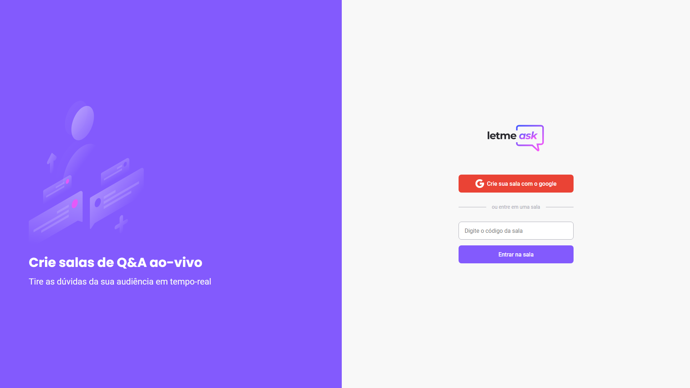
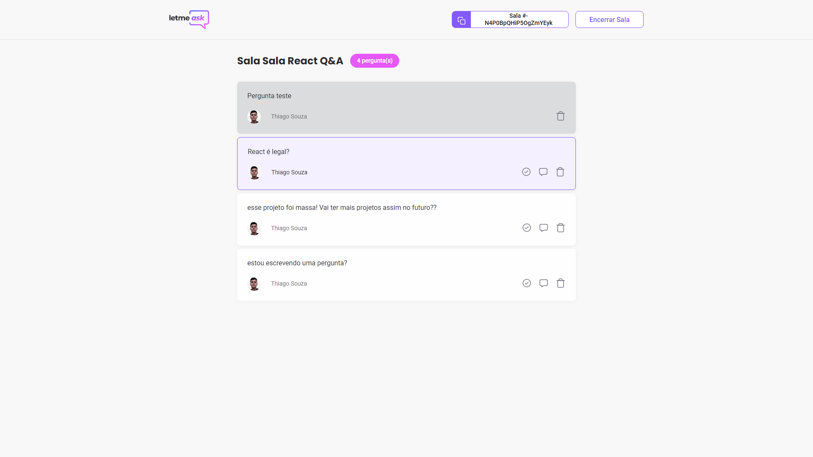

# nlw together
## Projeto: letmeask
link da aplicação: https://letmeask-946a0.web.app/

### Sobre
A aplicação consiste criar ou entrar em uma sala e fazer perguntas.

Este é um projeto desenvolvido durante a **[Next Level Week Together](https://nextlevelweek.com/)**, apresentada dos dias 20 a 27 de Junho de 2021.

Este projeto foi desenvolvido utilizando as seguintes <strong>tecnologias</strong>: 

- [React](https://reactjs.org)
- [Firebase](https://firebase.google.com/)
- [TypeScript](https://www.typescriptlang.org/)

#### pagina inicial

#### pagina da sala do usuário

#### pagina da sala do admin


### Como Executar

```bash
$ git clone https://github.com/ThiagodePaulaSouza/react-exercises
$ cd react-exercises/letmeask
```
Para iniciá-lo, siga os passos abaixo:
```bash
# Instalar as dependências
$ yarn
# Iniciar o projeto
$ yarn start
```
O app estará disponível no seu browser pelo endereço http://localhost:3000.

Lembrando que será necessário criar uma conta no [Firebase](https://firebase.google.com/) e um projeto para disponibilizar um Realtime Database.

### Veja o Layout original do projeto

Você pode visualizar o layout do projeto através do link abaixo:

- [Layout Figma](https://www.figma.com/community/file/1009824839797878169/Letmeask) 

Lembrando que você precisa ter uma conta no [Figma](http://figma.com/).

### Como Fazer Deploy da aplicação com firebase
`npm install -g firebase-tools`
`firebase login`
`firebase init`
`yarn build`
`firebase deploy`